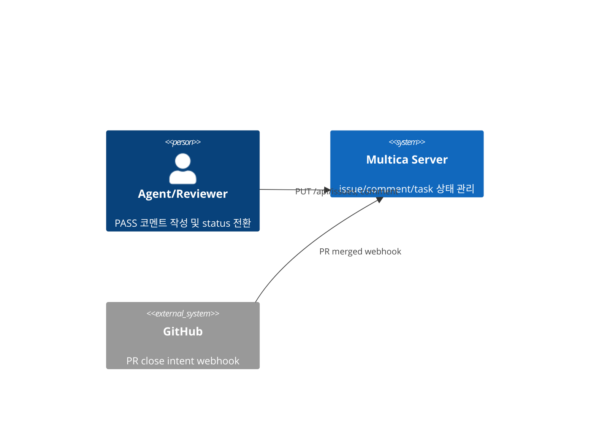
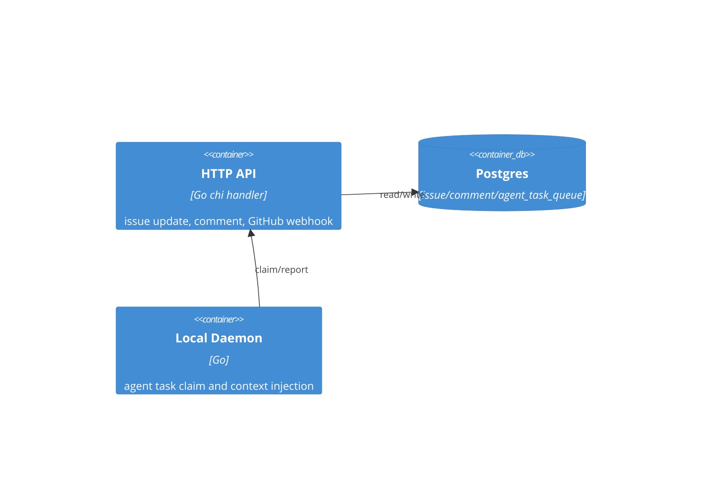
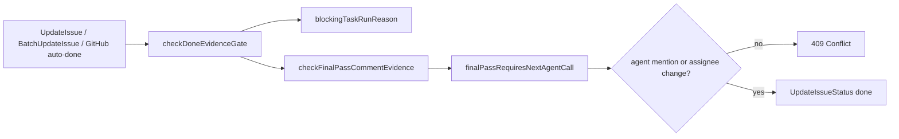

# Architecture — NEX-630

## 1. System Context (C4 Level 1)

## 2. Container View (C4 Level 2)

## 3. Component View (C4 Level 3)

## 4. Code View

- `server/internal/handler/issue_evidence_gate.go`: Evidence Gate 판단 중심.
- `server/internal/handler/issue.go`: 단일/배치 API status update 진입점.
- `server/internal/handler/github.go`: PR close intent auto-done 진입점.
- `server/internal/daemon/execenv/*`: GPT/Codex/Claude 컨텍스트 파일 및 skill/resource 주입.

## 5. Deployment View

- 서버 API 컨테이너가 Postgres와 통신한다.
- 로컬 daemon은 task를 claim하고 provider별 workdir/`CODEX_HOME`/runtime md를 준비한다.
- 이번 변경은 서버 handler 레벨이라 별도 인프라 추가가 없다.

## 6. Process View

1. Agent가 PASS 코멘트를 작성한다.
2. Agent 또는 webhook이 issue status를 `done`으로 전환한다.
3. Evidence Gate가 failed/cancelled run, PASS 증거, no-op 증거, handoff 누락을 검사한다.
4. handoff 필요 문구가 있는데 agent mention 또는 assignee 변경이 없으면 `409 Conflict`로 status 전환을 막는다.

## 7. Logical View

- `Issue`: 상태 전환 대상.
- `Comment`: 최종 PASS 증거 및 handoff 선언.
- `AgentTaskQueue`: 실패 run scan 대상.
- `TaskContextForEnv`: 런타임 컨텍스트 원천 데이터.

## 8. Scenarios View

- 정상: QA PASS에 `mention://agent/<UUID>`가 있고 증거가 충분하면 `done` 허용.
- 실패: QA PASS에 `다음 담당자`가 있지만 mention/assignee 변경이 없으면 `409`.
- 실패: unsupported model/failed/cancelled run이 있으면 기존 Evidence Gate에서 `409`.

## 9. Quality Attribute Scenarios

| QA | Stimulus | Response | Measure |
|---|---|---|---|
| Reliability | PASS 후 다음봇 누락 | 서버가 done 차단 | HTTP 409 |
| Modifiability | 새 PASS 템플릿 추가 | 키워드/검사 함수 확장 | 단일 파일 변경 |
| Compatibility | leaf issue done | handoff 문구 없으면 기존 흐름 유지 | 기존 테스트 통과 |
| Observability | 차단 발생 | 한국어 blocking reason 반환 | 응답 body 포함 |
